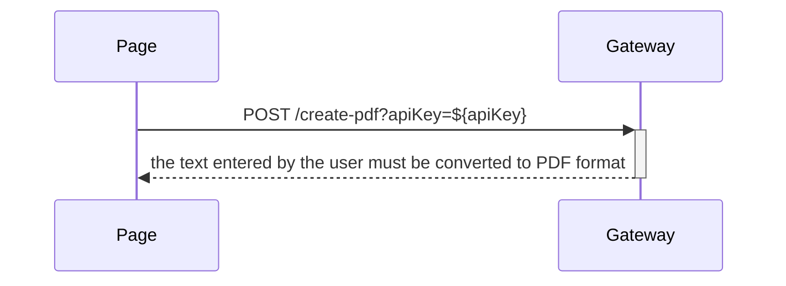

# _PDF Converter_

_Application description:_
The PDF Converter is a tool that allows users to easily convert text into PDF documents.

## Table of Contents

<ul>
<li><a href="#sequence-diagram">Sequence Diagram</a></li>
<li><a href="#endpoints">Endpoints</a></li>
<li> <a href="#requirements">Requirements</a></li>
<li> <a href="#how-to-run">How to run :rocket:</a></li>
<li> <a href="#testing">Testing</a></li>
</ul>

## <h2 id="sequence-diagram">Sequence Diagram</h2>



<h2 id="endpoints">Integration Endpoints</h2>
<table>
<tr>
<th> HTTP METHOD </th> <th> URL </th> <th> Payload/Query params </th> <th> Description </th>
</tr>
<tr>
<td> POST </td>
<td> apiHost/create-pdf?apiKey=${apiKey} </td>
<td>
-
</td>
<td>the text entered by the user must be converted to PDF format
</td>
</tr>
</table>

<h2 id="requirements">Requirements</h2>
- Node v18.20.5
- React ^19.0.0
- tailwindcss ^3.3.0
- jest - ^29.7.0

<h2 id="how-to-run">How to run :rocket:</h2>
``` bash
# install dependencies
yarn

# serve with hot reload

yarn start

````


<h2 id="testing">Testing</h2>
```bash
# run unit tests as in CI
yarn test
````
